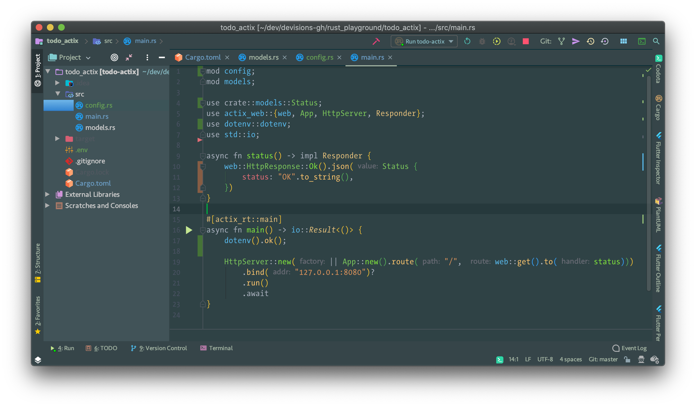

# Vipassana theme for IntelliJ

This is my initial tryout of creating an IntelliJ theme, initially inspired by Qiita theme that exists for VSCode.
 
It's still a WIP, so please excuse some aspects, and raise an issue for things you want to be improved, and I'll try to solve it. 

### TODOs

- left background of a selected element (currently has a gradient blue background for some reason)
- modal window title background (header?) (ex: New File window)
- dropdown background
- icon buttons hover background & foreground

